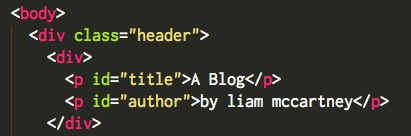
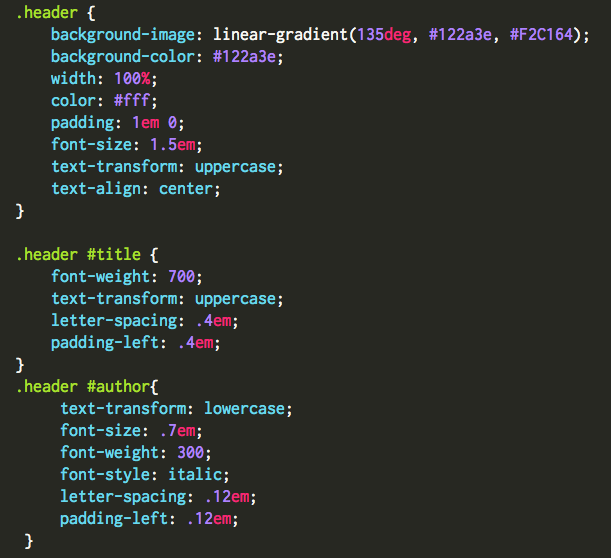
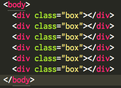
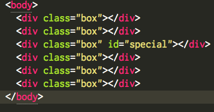

## Classes vs Ids
When styling your website using CSS you have two powerful tools at your disposable to select specific HTML elements, Classes and IDs. At first glance it looks like they look like they do the same thing, but in fact they are intended to be used in different ways.

To use Classes or IDs in your CSS stylesheet you first need to denote them in your HTML file, like so:

Then you can select these elements in your style sheet like this:

The best analogy that I have found to describe the difference between an ID and a Class is the barcode/serial number analogy. A barcode indicates a type of product, and is the same for all instances of that product. It tells the store's computers what the product is and how much it costs. A serial number is specific and unique to one individual unit of a product.

Take, for example, your laptop, when you purchased it the clerk scanned its barcode to look up the store’s information on that type of laptop and to retrieve its price. Then, a year later, when you need to check on the laptop's warranty, you look it up using its serial number because the information you want is specific to your laptop, not that type of laptop.

p> Back in CSS-land you can think of classes as acting like barcodes. They can be used on multiple elements at one time. lasses allow you to style several elements with a single selector in the stylesheet of your webpage.

If Classes behave like barcodes, then IDs are like serial numbers. They are unique and can only be used once on one element. IDs allow you to select a single element easily in CSS. It doesn’t matter where that element is, or if it even is a part of a class, your stylesheet can access it immediately.

As you can see above, elements can have both a class and an id, which allows you to select specific elements of a large class. IDs allow you to style a single element no matter where it is within the DOM.

Use both of these judicially. Being overly specific isn't always necessary. For example, you don't need to give all your links a class of "link" instead you can select them just using the a selector in CSS. If there are more specific links you need to style you can either select them using a relationship, or give them an ID.

Classes and IDs are powerful tools that can simplify your CSS sheets, if you know how to use them properly!